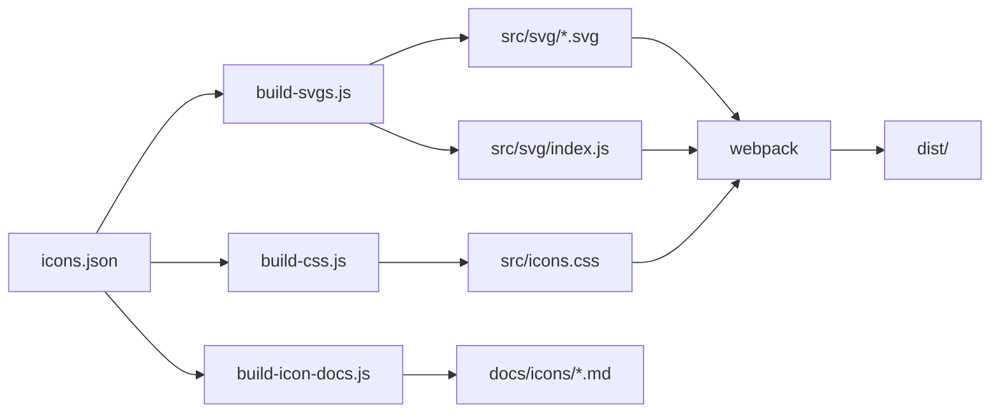

# SenangStart Icons Architecture

This skill provides a comprehensive understanding of the SenangStart Icons library architecture.

## Overview

SenangStart Icons is an SVG icon library with two delivery methods:
1. **Web Component** (`<ss-icon>`) - Dynamic icon rendering with thickness control
2. **CSS Classes** (`<i class="ss ss-{slug}">`) - Static mask-based icons

## Project Structure

```
senangstart-icons/
├── src/
│   ├── icons.json         # Master icon definitions
│   ├── icons.css          # Generated CSS (mask-based)
│   ├── index.js           # Main entry point
│   ├── ss-icon.js         # Web Component definition
│   ├── ss-loader.js       # Class-based icon loader
│   ├── style.css          # Base styles
│   └── svg/               # Generated SVG files
│       ├── index.js       # Icon exports
│       └── {slug}.svg     # Individual icons
├── dist/                  # Bundled output
├── docs/                  # VitePress documentation
├── scripts/               # Build scripts
└── tests/                 # Vitest tests
```

## Core Components

### 1. Icon Definitions (`src/icons.json`)

The single source of truth for all icons:

```json
{
  "name": "Check",
  "slug": "check",
  "src": "M5 13l4 4L19 7",
  "tags": ["approve", "success", "done"]
}
```

Optional properties: `viewBox`, `fill`, `stroke`, `strokeWidth`

### 2. Web Component (`src/ss-icon.js`)

Custom element that renders icons dynamically:

```html
<ss-icon icon="check" thickness="1.5"></ss-icon>
```

Features:
- Shadow DOM encapsulation
- Reactive to `icon` and `thickness` attribute changes
- Inherits color from `currentColor`
- Scales with font size (1em × 1em)

### 3. Class Loader (`src/ss-loader.js`)

Injects SVG into elements with `ss ss-{slug}` classes:

```html
<i class="ss ss-check"></i>
```

Features:
- Automatic DOM observation for dynamic content
- Uses MutationObserver for live updates
- Marks processed elements with `data-ss-loaded`

### 4. CSS Icons (`src/icons.css`)

Pure CSS icons using mask-image:

```css
.ss { /* base styles */ }
.ss-check {
  -webkit-mask-image: url("data:image/svg+xml,...");
  mask-image: url("data:image/svg+xml,...");
}
```

Advantages: No JavaScript required, inherits text color

## Build Pipeline



## Key Files Reference

| File | Purpose |
|------|---------|
| `src/icons.json` | Icon definitions (add icons here) |
| `src/ss-icon.js` | Web Component class |
| `src/ss-loader.js` | DOM mutation observer for class-based icons |
| `scripts/build.js` | Orchestrates full build |
| `scripts/build-svgs.js` | Generates SVG files |
| `scripts/build-css.js` | Generates CSS with mask-image |
| `scripts/build-icon-docs.js` | Generates VitePress docs |
| `webpack.config.js` | Bundle configuration |
| `vitest.config.js` | Test configuration |
